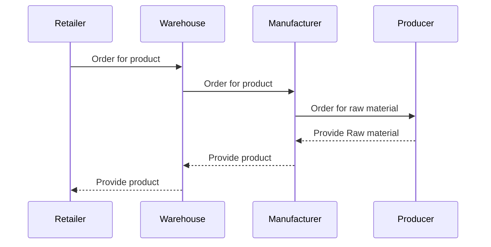

# My_Learning_Hyperledger

This is a repository for my learning Hyperledger. I will record my learning process and some notes here.

## Overview

- It is a full-blown enterprise grade blockchain platform especially for B2B use cases.
- It allows to create different channels b/w different organizations/entities.
- Example: There are 4 different entities in a supply chain use case.
  - **Producer (P)**: Produces the raw material needed for production.
  - **Manufacturer (M)**: Manufactures the product usign the raw material.
  - **Warehouse (W)**: Stores the product for distribution.
  - **Retailer (R)**: Sells the product to the end customer/user after receiving the item from the warehouse.

## Terms

| Traditional Blockchain              | Hyperledger                                                                                      |
| ----------------------------------- | ------------------------------------------------------------------------------------------------ |
| smart contract                      | chaincode                                                                                        |
| validator(s)                        | orderer(s) (every architecture has at least one node named orderer to sequence the transactions) |
| ledger                              | channel (each (communication) channel can have a ledger)                                         |
| RPC node                            | authorized peer (every entity has this node to validate the transaction)                         |
| gas cost                            | server cost                                                                                      |
| elliptic curve (ECDSA) cryptography | elliptic curve (ECDSA) cryptography                                                              |
| public key                          | Certificate (found in X.509 digital certificate)                                                 |
| private key                         | key                                                                                              |

More about identity management [here](https://hyperledger-fabric.readthedocs.io/en/release-2.0/identity/identity.html).

## References

- [chaincode examples on Github in Go, Java, JS](https://github.com/hyperledger/fabric-samples)
