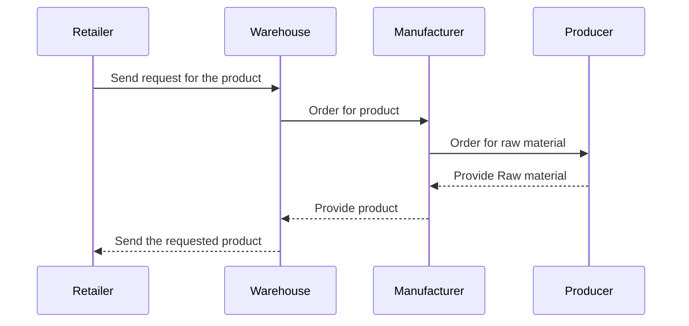
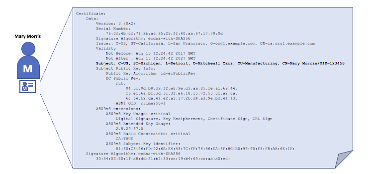
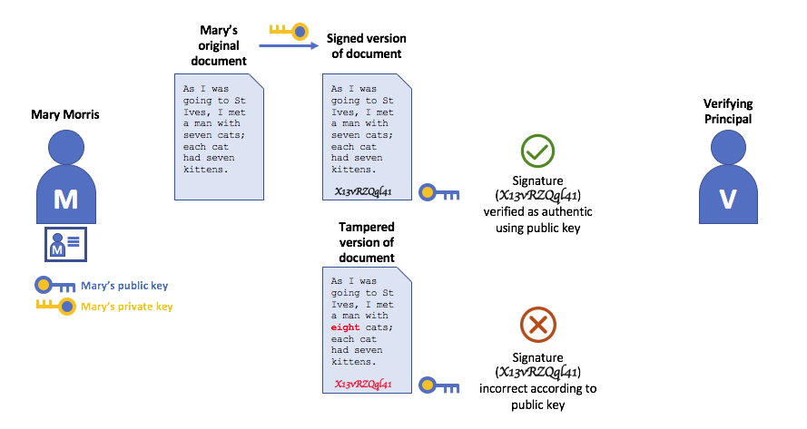
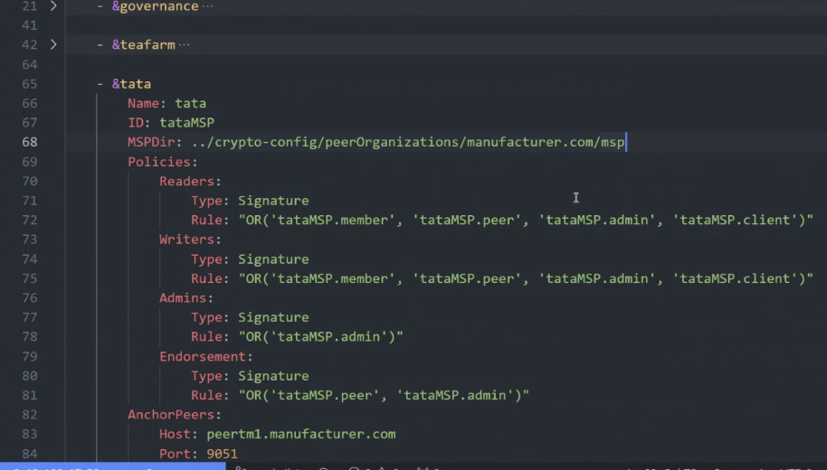
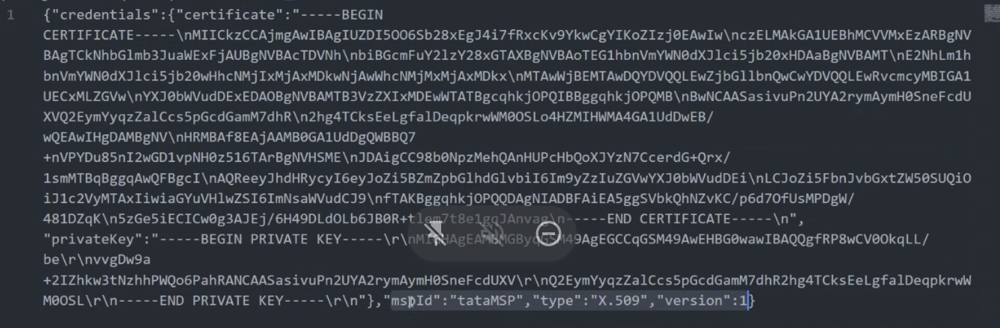

# My_Learning_Hyperledger

This is a repository for my learning Hyperledger. I will record my learning process and some notes here.

## Overview

- It is a full-blown enterprise grade blockchain platform especially for B2B use cases.
- It allows to create different channels b/w different organizations/entities.

---

- Example: There are 4 different entities in a supply chain use case.
  - **Producer (P)**: Produces the raw material needed for production.
  - **Manufacturer (M)**: Manufactures the product usign the raw material.
  - **Warehouse (W)**: Stores the product for distribution.
  - **Retailer (R)**: Sells the product to the end customer/user after receiving the item from the warehouse.



## Terms & Comparo

| Traditional Blockchain              | Hyperledger                                                                                      |
| ----------------------------------- | ------------------------------------------------------------------------------------------------ |
| smart contract                      | chaincode                                                                                        |
| validator(s)                        | orderer(s) (every architecture has at least one node named orderer to sequence the transactions) |
| ledger                              | channel (each (communication) channel can have a ledger)                                         |
| RPC node                            | anchor peers (every entity has this node to validate the transaction)                            |
| gas cost                            | server cost                                                                                      |
| elliptic curve (ECDSA) cryptography | elliptic curve (ECDSA) cryptography                                                              |
| public key                          | Certificate (found in X.509 digital certificate)                                                 |
| private key                         | key                                                                                              |

More about identity management [here](https://hyperledger-fabric.readthedocs.io/en/latest/identity/identity.html).

- **MSP**: Memebership Service Provider
- **[PKI](https://hyperledger-fabric.readthedocs.io/en/latest/identity/identity.html#what-are-pkis)**: Public Key Infrastructure
- **[Digital Cerificate](https://hyperledger-fabric.readthedocs.io/en/latest/identity/identity.html#digital-certificates)**: Like a passport for a person, it is a document that contains the public key of the entity.
  
- **[Authentication, Public keys, and Private Keys](https://hyperledger-fabric.readthedocs.io/en/latest/identity/identity.html#authentication-public-keys-and-private-keys)**
  

  > Here, a `recover_signer(hash(orig_msg), signed_msg)` function returns the `actual_signer` which is checked with `claimed_signer` to verify the authenticity of the message.

  ```js
  // here, signed_msg i.e. signature is composed of (hashed_orig_msg + private key).
  // So, altogether, the function holds private_key using which it's going to return public_key when leveraged.
  // This is how mathematically, it generates the public_key (signer).
  recover_signer(hash(orig_msg), signature) == claimed_signer;
  ```

  [learn coding for verify sig on Ethereum](https://www.web3.university/article/how-to-verify-a-signed-message-in-solidity)

## Coding

Organization is defined in `configtx.yaml` file. Here, the organization is defined with an `ID`. This `ID` is used to refer to the organization in the code.



---

User certificate is generated using `cryptogen` tool. Here, the organizationId is defined in `mspId` field using which a user is checked for.



## References

- [chaincode examples on Github in Go, Java, JS](https://github.com/hyperledger/fabric-samples)
- [Deploy your smart contract on Hyperledger | Hyperledger Course | Code Eater - Blockchain| Hindi](https://youtu.be/uFwkLlZQEGY)
